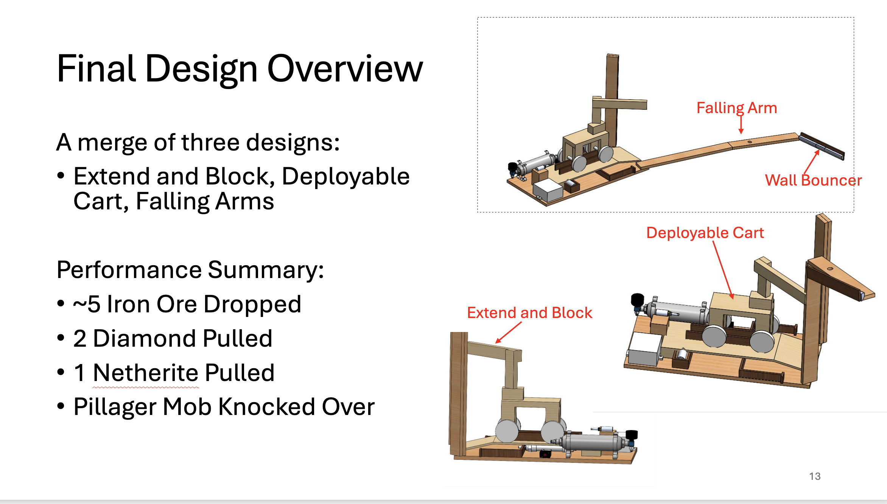

# Competition Robot

An autonomous robot built for a Georgia Tech design competition. Once the round starts, it runs
a fixed sequence of tasks with no human input.

## The competition

- 4 person team, one semester
- Minecraft themed arena with four scoring tasks
- Hard limits on actuators, power, size and materials
- No human control after the start signal

## Final design

The robot that competed merged three of our concepts:

- **Extend and Block:** a frame that extends outward to block a section of the arena
- **Deployable Cart:** a rolling cart released from the base
- **Falling Arms:** a long arm that drops across the arena, with a wall bouncer at the tip

## Results

- About 5 iron ore dropped
- 2 diamonds pulled
- 1 netherite pulled
- Pillager mob knocked over

## How it works

- Pneumatic cylinders drive the main motions
- An Arduino runs a state machine that fires each mechanism in order on timed delays
- The sequence is open loop, so nothing corrects itself once the round starts
- That put the burden on mechanical tolerances, which had to be tight enough to repeat the same
  run every time rather than work once on the bench

## Mechanisms designed during the project

- **Passive claw:** a container holds the fingers open, and pressing the claw onto an object lets
  the container ride up so an elastic band snaps the fingers shut. Grabbing the object is what
  triggers it, so no motor or servo is needed.
- **Single motor lift:** a segmented assembly pulled up by one DC motor winding nylon line, so
  one motor both raises the payload and holds it at height.
- **Crossbow arms:** two extending arms that push objects aside, then wind back on a shared
  string to drag targets in. One winding mechanism moves both arms together.

## Tools

- Arduino, C++, myDuino library
- Pneumatic cylinders and solenoids
- DC motors
- 3D printed parts
- CAD for the full assembly

## Files

- `code/` Arduino sketches, including the final competition sequence
- `media/` design overview, renders, and a claw test clip
